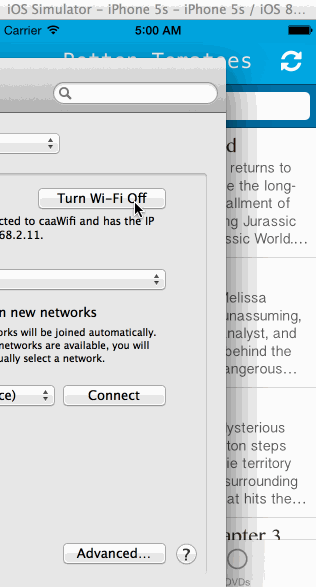

# ios-rottenTomatoes

This is a movies app displaying box office and top rental DVDs using the [Rotten Tomatoes API](http://developer.rottentomatoes.com/docs/read/JSON).

Time spent: 18 hours

### Features

#### Required

- [X] User can view a list of movies. Poster images load asynchronously.
- [X] User can view movie details by tapping on a cell.
- [X] User sees loading state while waiting for the API.
- [X] User sees error message when there is a network error: https://goo.gl/HQawDN
- [X] User can pull to refresh the movie list.

#### Optional

- [X] All images fade in.
- [X] For the larger poster, load the low-res first and switch to high-res when complete.
- [X] All images should be cached in memory and disk: AppDelegate has an instance of `NSURLCache` and `NSURLRequest` makes a request with `NSURLRequestReturnCacheDataElseLoad` cache policy. I tested it by turning off wifi and restarting the app.
- [X] Customize the highlight and selection effect of the cell.
- [X] Customize the navigation bar.
- [X] Add a tab bar for Box Office and DVD.
- [X] Add a search bar: pretty simple implementation of searching against the existing table view data.
- [ ] Implement segmented control to switch between list view and grid view

#### Additional
- [X] Must use Cocoapods
- [X] Asynchronous image downloading must be implemented using the UIImageView category in the AFNetworking library.

### Walkthrough

### Error Message

### Offline Cache

Credits
---------
* [Rotten Tomatoes API](http://developer.rottentomatoes.com/docs/read/JSON)
* [AFNetworking](https://github.com/AFNetworking/AFNetworking)
* [SVProgressHUD] (https://github.com/samvermette/SVProgressHUD)
* [TSMessage] (https://github.com/KrauseFx/TSMessages)
* [FontAwesomeIconFactory] (https://github.com/nschum/FontAwesomeIconFactory)
* [Pull to Refresh] (http://www.appcoda.com/pull-to-refresh-uitableview-empty/)
* [Customize Navigation Bar] (http://www.appcoda.com/customize-navigation-status-bar-ios-7/)
